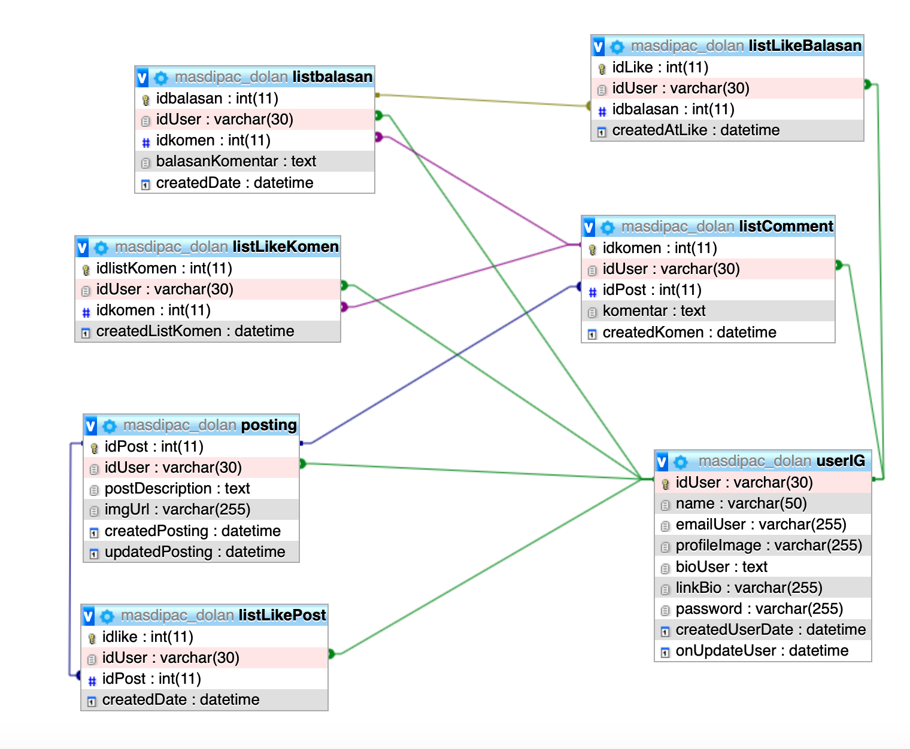
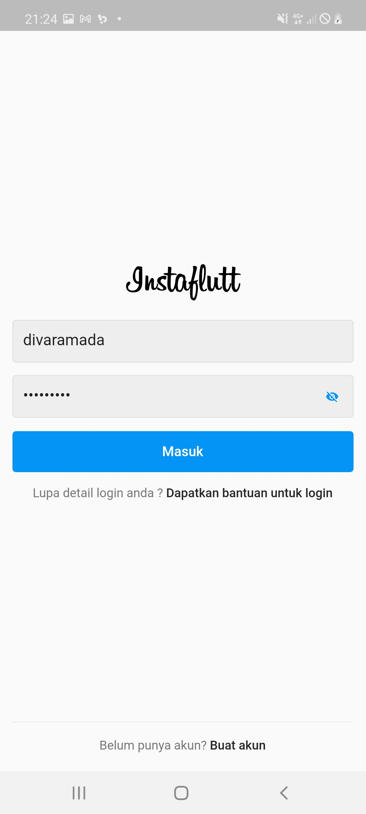

# Instagram App Using Flutter By Diva
> Login Page, Home Page, Profile Page


The simple database schema I use is :



## Install and try

to try this code, all you need is

```sh
* download this project
* Run with flutter run or
* flutter run --release
```

## User interface of application

 | 

## Meta

Seu Nome – [@SeuNome](https://twitter.com/...) – SeuEmail@exemplo.com

Distribuído sob a licença XYZ. Veja `LICENSE` para mais informações.

[https://github.com/yourname/github-link](https://github.com/othonalberto/)

## Contributing

1. Faça o _fork_ do projeto (<https://github.com/yourname/yourproject/fork>)
2. Crie uma _branch_ para sua modificação (`git checkout -b feature/fooBar`)
3. Faça o _commit_ (`git commit -am 'Add some fooBar'`)
4. _Push_ (`git push origin feature/fooBar`)
5. Crie um novo _Pull Request_

[npm-image]: https://img.shields.io/npm/v/datadog-metrics.svg?style=flat-square
[npm-url]: https://npmjs.org/package/datadog-metrics
[npm-downloads]: https://img.shields.io/npm/dm/datadog-metrics.svg?style=flat-square
[travis-image]: https://img.shields.io/travis/dbader/node-datadog-metrics/master.svg?style=flat-square
[travis-url]: https://travis-ci.org/dbader/node-datadog-metrics
[wiki]: https://github.com/seunome/seuprojeto/wiki
