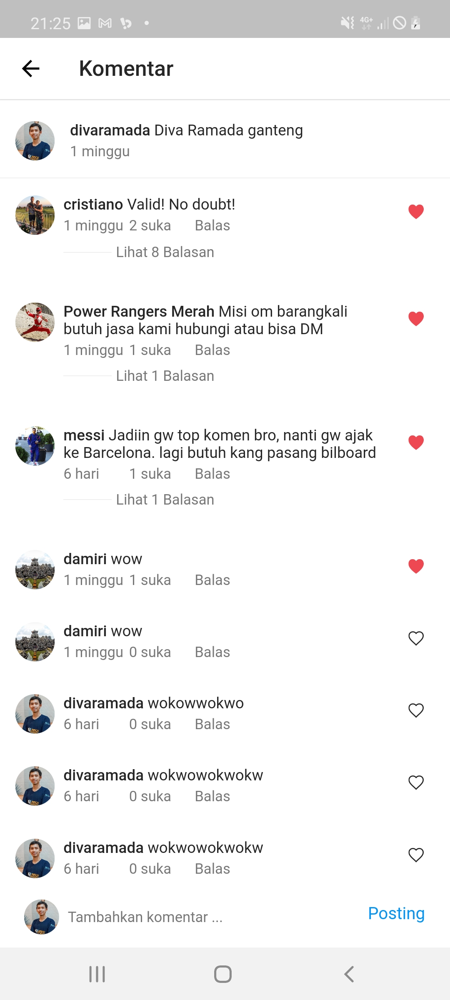
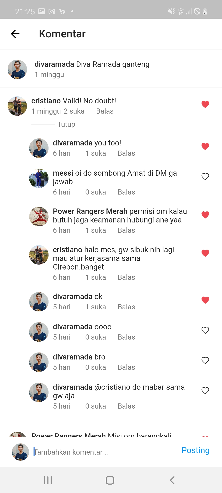

# Instagram App Using Flutter By Diva
> Login Page, Home Page, Profile Page


The simple database schema I use is :


im not good on backend side. I just a little bit to learning backend. so, correct me if my data structure is wrong.

## User interface of application

  




## Technology

this project is created with

```sh
* Flutter
* NodeJs (for API)
```

## Setup

to try this code, all you need is

```sh
* download this project
* Run flutter package get
* Run this code using flutter run or
* flutter run --release
```
